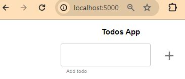
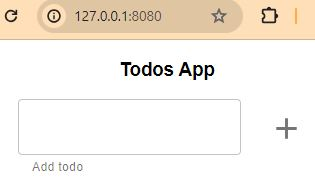
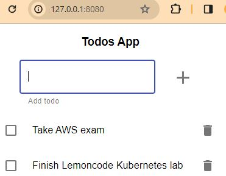

# Todo Application - Monolith in memory
1. [Introduction](#intro)
2. [Create the image](#image)
3. [Create the deployment](#deploy)
4. [Create the service](#service)
5. [How to use the todo-app application](#usage)
6. [Cleaning Up](#cleaning)
7. [How to build image against the docker inside minikube](#locally)

<a name="intro"></a>
## 1. Introduction
We've been asked by LemonCode team to create the Kubernetes resources to build a cluster like the following picture:


* This is an UI app (the typical to-do list app) with an API to manage in the server the 'TODOS'. 

* The TODOS persistency is in-memory, which means that the data is lost when app is closed. 

* The UI app is exposed via a LoadBalancer service.
  There are two major categories of services in Kubernetes:
  * NodePort
  * LoadBalancer

  In this solution, we will be using a LoadBalancer service which is the standard way to expose a service to the internet. With this method, each service gets its own IP address.

Solution structure 

```
├── manifests (new) 
│   ├── todo-app-deployment.yaml 
│   ├── todo-app-service.yaml 
├── todo-app (existing)
│   ├── ...
│   ├── Dockerfile 
│   ├── README.md 
├── monolith-in-memory.png (existing)
├── todo-app-port-forward.JPG (new)
├── todo-app-service.JPG (new)
├── todo-app-tasks.JPG (new)
├── README.md (new)
```

<a name="image"></a>
## 2. Create the image
Create an image of the todo-app application

```bash
docker build -f todo-app/Dockerfile -t binarylavender/todo-app-monolith-in-mem:v1 todo-app/ 
```

Push to Docker Hub repository (registry configured by default)
```bash
docker push binarylavender/todo-app-monolith-in-mem:v1
```
Check that the image is created
```
$  docker image ls | grep todo-app-monolith-in-mem
binarylavender/todo-app-monolith-in-mem                                       v1                                                      29f41f209efe   14 hours ago    95.2MB
            29f41f209efe   14 hours ago    95.2MB
```
<a name="deploy"></a>
## 3. Create the deployment

Create a Kubernetes deployment, called e.g. `todo-app-deployment.yaml` and apply it.

```yaml
apiVersion: apps/v1
kind: Deployment
metadata:
  name: todo-app-deployment
spec:
  replicas: 1
  selector:
    matchLabels:
      app: todo-app
  template:
    metadata:
      labels:
        app: todo-app        
    spec:
      containers:
      - name: todo-app
        image: binarylavender/todo-app-monolith-in-mem:v1
        imagePullPolicy: IfNotPresent
        resources:
          requests:
            memory: "64Mi"
            cpu: "250m"
          limits:
            memory: "128Mi"
            cpu: "500m"
        ports:
          - containerPort: 5000
        env:
          - name: NODE_ENV
            value: "production"
          - name: PORT
            value: "5000"
```

```bash
  kubectl apply -f k8s/todo-app-deployment.yaml
```
The output of a successful command verifies that the deployment was created:

```
deployment.apps/todo-app-deployment created
```

View the pod status to check that it is ready:
```bash
kubectl get pods -l app=todo-app
```

The output displays the pod is created:
```
NAME                                   READY   STATUS    RESTARTS   AGE
todo-app-deployment-76875d5797-l4h56   1/1     Running   0          11m
```
We can see that the pod is running OK.

View the deployment's status:

```bash
kubectl get deployment
```

The output displays that the Deployment was created:
```
NAME                  READY   UP-TO-DATE   AVAILABLE   AGE
todo-app-deployment   1/1     1            1           21m
```

If we've got access to the local machine, to easily check that the todo-app application is ready to accept requests, we could forward a local port to a port on the Pod. kubectl port-forward allows using resource name, such as a pod name, to select a matching pod to port forward to.

```shell
$ kubectl port-forward deployment/todo-app-deployment 5000
Forwarding from 127.0.0.1:5000 -> 5000
Forwarding from [::1]:5000 -> 5000
```

Note: kubectl port-forward does not return. To continue with the exercises, you will need to open another terminal.

Open in your browser http://localhost:5000

We can see that the app is running succesfully.


If we don't have access to the local machine, we could run an interactive pod.

First let's get the pod's IP by running:
```
$ kubectl get pods -o wide
NAME                                   READY   STATUS    RESTARTS   AGE   IP             NODE       NOMINATED NODE   READINESS GATES
todo-app-deployment-5f5df4ff47-8mtrb   1/1     Running   0          26m   10.244.0.112   minikube   <none>           <none>
```
Then spin up a busybox pod and explore your deployment with it.

```
$ kubectl run bb --image busybox -it --restart=Never --rm
If you don't see a command prompt, try pressing enter.
/ #
/ #
/ # wget -O- -S http://10.244.0.112:5000
Connecting to 10.244.0.112:5000 (10.244.0.112:5000)
  HTTP/1.1 200 OK
  X-Powered-By: Express
  Accept-Ranges: bytes
  Cache-Control: public, max-age=0
  Last-Modified: Wed, 20 Dec 2023 23:23:23 GMT
  ETag: W/"179-18c898a79f8"
  Content-Type: text/html; charset=UTF-8
  Content-Length: 377
  Date: Wed, 03 Jan 2024 20:58:44 GMT
  Connection: close

writing to stdout
<!doctype html><html lang="en"><head><meta charset="UTF-8"><meta name="viewport" content="width=device-width,initial-scale=1"><title>Document</title><script defer="defer" src="app.c42faa8600e529266bfb.js"></script><script defer="defer" src="appStyles.4714fda6c70bf1ad7ccd.js"></script><link href="appStyles.css" rel="stylesh-                    100% |******************************************************************************************************************|   377  0:00:00 ETA 
written to stdout
/ # exit
pod "bb" deleted
```

You can see here I run a busybox image and I run `wget -O- -S http://10.244.0.112:5000` command to send an HTTP request and it shows the connection to the pod is succesful with response 200, so there is connectivity inside the cluster.


<a name="service"></a>
## 4. Create the service

A service is an abstraction that defines the access to a set of pods. By using a service, you don’t access pods directly through their private IP addresses. Instead, a service targets several pods based on certain criteria (for example, the label `app: todo-app`) and forwards any requests to one of the pods matching that criteria.

In other words, a service allows you to group pods with a logical relationship and it allows you to reach them in a reliable way. At the same time, it implements a load-balancing mechanism among the pods that it targets.

Create a Kubernetes service with type LoadBalancer to expose the todo-app on Internet.

todo-app-service.yaml
```yaml
apiVersion: v1
kind: Service
metadata:
  name: todo-app-service
spec:
  selector:
    app: todo-app
  ports:
  - port: 8080
    targetPort: 5000
  type: LoadBalancer
```

```bash
kubectl apply -f k8s/todo-app-service.yaml
```
The output of a successful command verifies that the Service was created:
`service/todo-app-service created`

Check the endpoints of the service just created:
```bash
$ kubectl get endpoints
NAME               ENDPOINTS           AGE
todo-app-service   10.244.0.112:5000   27s
```

Check the Service created:
```bash
kubectl get service todo-app-service
```

The output displays the service created:
```
NAME               TYPE           CLUSTER-IP       EXTERNAL-IP   PORT(S)          AGE
todo-app-service   LoadBalancer   10.101.207.140   <pending>     8080:32476/TCP   73s
```

Note that without minikube tunnel, Kubernetes will show the external IP as “pending”. From a separate terminal, run the following command:

```bash
minikube tunnel
```

Ctrl-C in the terminal can be used to terminate the process at which time the network routes will be cleaned up. More information in [minikube.sigs.k8s.io/docs/handbook/accessing](https://minikube.sigs.k8s.io/docs/handbook/accessing/) and [kubernetes.io/docs/concepts/services-networking/service](https://kubernetes.io/docs/concepts/services-networking/service/).

```bash
$ kubectl get service todo-app-service
NAME               TYPE           CLUSTER-IP       EXTERNAL-IP   PORT(S)          AGE
todo-app-service   LoadBalancer   10.101.207.140   127.0.0.1     8080:32476/TCP   17m
```
Now todo-app application is available outside of your cluster through the URL
[http://127.0.0.1:8080/](http://127.0.0.1:8080/)



<a name="usage"></a>
## 5. How to use the todo-app application

Let's add some tasks:



If we scale down the deployment, and then we scale it up to 1, we observe the data (list of tasks) is lost because the persistency is in-memory.

```bash
$ kubectl scale --replicas=0 deployment/todo-app-deployment
deployment.apps/todo-app-deployment scaled


$ kubectl scale --current-replicas=0 --replicas=1 deployment/todo-app-deployment
deployment.apps/todo-app-deployment scaled
```

If we scale up the deployment to 2 pods, once the tasks are stored, and refresh the web, we observe the data (list of tasks) is different depending on which pod is responding to the request.


```bash
# If the deployment named todo-app-deployment's current size is 1, scale todo-app-deployment to 2.

$ kubectl scale --current-replicas=1 --replicas=2 deployment/todo-app-deployment
deployment.apps/todo-app-deployment scaled
```

<a name="cleaning"></a>
## 6. Cleaning Up

1. Delete all the resources created. This also begins terminating the Pods.

```bash
$ kubectl delete -f .
deployment.apps "todo-app-deployment" deleted
service "todo-app-service" deleted
```

Note that to apply all the resources under a folder, you can run: `kubectl apply -f .`

2. Verify that the Pods disappear. They might take some time to finish terminating.
```bash
$ kubectl get pods -l app=todo-app
```

You'll know the Pods have terminated when the above returns:
`No resources found.`

<a name="locally"></a>
## 7. How to build image locally against the docker inside minikube

To push your image directly to the in-cluster Docker daemon, you need to point your terminal to use the docker daemon inside minikube by running this bash command in Windows:
```bash
eval $(minikube -p minikube docker-env)
```

To verify your terminal is using minikube’s docker-env you can check the value of the environment variable MINIKUBE_ACTIVE_DOCKERD to reflect the cluster name.

```bash
minikube docker-env
```
Result

```
export DOCKER_TLS_VERIFY="1"
export DOCKER_HOST="tcp://127.0.0.1:53081"
export DOCKER_CERT_PATH="C:\Users\LENOVITO\.minikube\certs"
export MINIKUBE_ACTIVE_DOCKERD="minikube"
```

Now any ‘docker’ command you run in this current terminal will run against the docker inside minikube cluster.

More information [here](https://minikube.sigs.k8s.io/docs/handbook/pushing/#1-pushing-directly-to-the-in-cluster-docker-daemon-docker-env).

Now you can ‘build’ against the docker inside minikube, which is instantly accessible to kubernetes cluster.

```bash
cd 00-monolith-in-mem/todo-app/
docker build . -t todo-app-monolith-in-mem
```

Tip 1: Remember to turn off the imagePullPolicy:Always (use imagePullPolicy:IfNotPresent or imagePullPolicy:Never) in your yaml file. Otherwise Kubernetes won’t use your locally build image and it will pull from the network.

Tip 2: Evaluating the docker-env is only valid for the current terminal. By closing the terminal, you will go back to using your own system’s docker daemon.

Tip 3: In container-based drivers such as Docker or Podman, you will need to re-do docker-env each time you restart your minikube cluster.