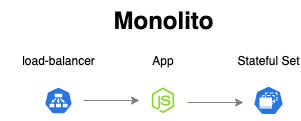
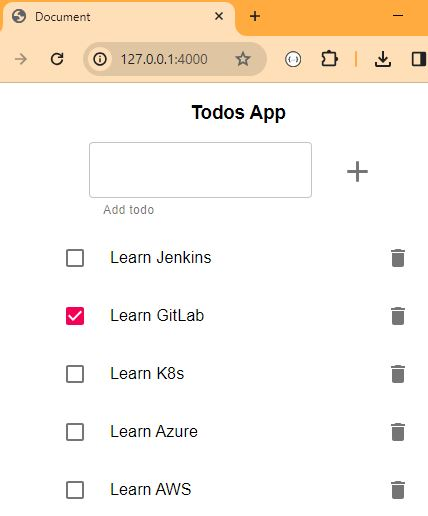
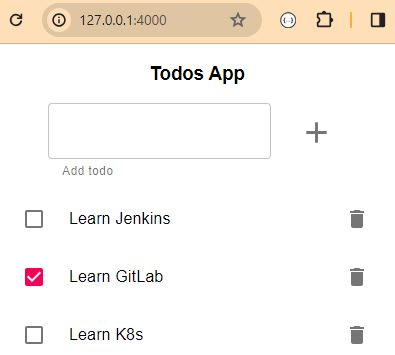
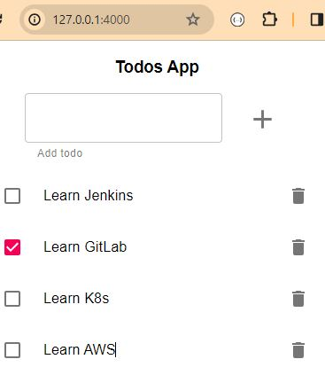

# Todo Application - Monolith - PostgreSQL
1. [Introduction](#intro)
2. [How to run the monolith locally and with Docker](#locally)
3. [Create a data persistence layer](#persistence)
4. [Create the todo-app image](#todo-app-image)
5. [Create the todo-app client and the service](#todo-app)
6. [End to end testing](#e2e)
7. [Cleaning Up](#cleaning)

<a name="intro"></a>
## 1. Introduction 
We've been asked by LemonCode team to [create the Kubernetes resources to build a cluster](https://github.com/Lemoncode/bootcamp-devops-lemoncode/blob/master/02-orquestacion/exercises/01-monolith/exercise-monolith.md) like the following picture:



The aim is to solve the problem of the monolith in memory of the first exercise, the data is lost when app is closed, by using a PostgreSQL database.

To do so, follow these steps:
1. Create a data persistence layer
2. Create the todo-app deployment
3. Access to todo-app from outside of your cluster

Solution structure 

```
├── manifests (new) 
│   ├── postgres (new)
│     ├── config (new)
│       ├── postgres.env (new)
│     ├── kustomization.yaml (new)
│     ├── postgres-persistentvolume.yaml (new)
│     ├── postgres-service.yaml (new)
│     ├── postgres-statefulset.yaml (new)
│     ├── postgres-storageclass.yaml (new)
│   ├── todo-app-client (new)
│     ├── config (new)
│       ├── client.env (new)
│     ├── kustomization.yaml (new)
│     ├── todo-app-deployment.yaml (new)
│     ├── todo-app-service.yaml (new)
├── todo-app (existing)
│   ├── ...
│   ├── Dockerfile 
│   ├── Dockerfile.todos_db 
│   ├── README.md 
│   ├── todos_db.sql
├── monolith-docker.md (new)
├── monolith-official-postgres-image.md (new)
├── README.md (new)
```
<a name="locally"></a>
## 2. How to run the monolith locally and with Docker

To run the monolith app locally, look at the steps in [run-solution-locally](./monolith-docker.md#1-how-to-run-the-monolith-locally).

To run the monolith app with Docker, look at the steps in [run-solution-with-docker](monolith-docker.md#2-how-to-run-the-monolith-with-docker).

<a name="persistence"></a>
## 3. Create a data persistence layer

### Create PostgreSQL image
We need a base PostgreSQL image, version 10.4. And on top of the image, the `todos_db.sql` script is copied into `/docker-entrypoint-initdb.d` directory. Based on the postgres Official Image [here](https://hub.docker.com/_/postgres) any *.sql scripts found in that directory will be run when a Postgres container starts up. The `todos_db.sql` script creates the `todos_db` database and populates it.

todo-app/Dockerfile.todos_db
```
FROM postgres:10.4

COPY ./todos_db.sql /docker-entrypoint-initdb.d
```

To create a custom database image run the following command:
```bash
docker build -f todo-app/Dockerfile.todos_db -t binarylavender/todo-app-postgres:v1 todo-app/
```

Push to Docker Hub repository:
`docker push binarylavender/todo-app-postgres:v1`

Check that the image is created
```
$  docker image ls | grep todo-app-postgres
binarylavender/todo-app-postgres                                              v1                                                      430cfff6c042   12 days ago    
 236MB
```

### Create PostgreSQL resources in Kubernetes
Create an `statefulset` kubernetes resource to have a Postgres database inside the cluster. To do so, we will need to set up the following resources:

* Config Map 
* [Headless Service](https://kubernetes.io/docs/concepts/services-networking/service/#headless-services).
  StatefulSets require you to create a headless service to control their network identities. A headless service defines a port binding but has its clusterIP set to None.

  The headless Service provides a home for the DNS entries that the StatefulSet controllers creates for each Pod that's part of the set. Because the headless Service is named postgres, the Pods are accessible by resolving <pod-name>.postgres from within any other Pod in the same Kubernetes cluster and namespace.

* [StatefulSet](https://kubernetes.io/docs/concepts/workloads/controllers/statefulset/)

I will use [Kustomize](https://kubernetes.io/docs/tasks/manage-kubernetes-objects/kustomization/) for the PostgreSQL persistence layer.

kustomization.yaml

```yaml
apiVersion: kustomize.config.k8s.io/v1beta1
kind: Kustomization
commonLabels:
  app: postgres

resources:
- postgres-storageclass.yaml
- postgres-persistentvolume.yaml
- postgres-service.yaml
- postgres-statefulset.yaml
configMapGenerator:
  - name: postgres-cm
    envs:
    - config/postgres.env  

generatorOptions:
  disableNameSuffixHash: true # use a static name
```

The key points here are:
* To deploy all the resources found in a directory containing a kustomization file, run (from the directory containing kustomization.yaml): `kubectl apply -k .`
* To view Resources found in a directory containing a kustomization file without deploying them, run the following command: `kubectl apply -k <kustomization_directory>`
  
  ```bash
  $ cd 01-monolith\k8s
  ```

  ```bash
  $ kubectl kustomize postgres
  ```
  
* Kustomize has configMapGenerator, which generates a ConfigMap called `postgres-cm` from the `config/postgres.env` env file that contains the database configuration:

  ```
  POSTGRES_PASSWORD=postgres
  ```

  Here is the ConfigMap generated manifest called `postgres-cm.yaml`:
  ```yaml
  apiVersion: v1
  data:
    POSTGRES_PASSWORD: postgres
  kind: ConfigMap
  metadata:
    labels:
      app: postgres
    name: postgres-cm
  ```

* Kustomize also supports composition of different resources defined in the resources field, in this case, it is comprised of the `postgres-storageclass.yaml`, `postgres-persistentvolume.yaml`, `postgres-service.yaml` and `postgres-statefulset.yaml` resources.
   
### Persistent Volume
A PersistentVolume (PV) is a piece of storage in the cluster that has been provisioned by an administrator or dynamically provisioned using Storage Classes.
PVs are volume plugins like Volumes, but have a lifecycle independent of any individual Pod that uses the PV. This API object captures the details of the implementation of the storage, be that NFS, iSCSI, or a cloud-provider-specific storage system.

Kubernetes supports hostPath for development and testing on a single-node cluster. A hostPath PersistentVolume uses a file or directory on the Node to emulate network-attached storage.

In a production cluster, you would not use hostPath. Instead a cluster administrator would provision a network resource like a Google Compute Engine persistent disk, an NFS share, or an Amazon Elastic Block Store volume. 

Here is the configuration file for the hostPath PersistentVolume called `postgres-persistentvolume.yaml`:

```yaml
apiVersion: v1
kind: PersistentVolume
metadata:
  name: mypv
  labels:
    app: postgres
spec:
  storageClassName: mysc
  volumeMode: Filesystem
  capacity:
    storage: 256Mi
  accessModes:
    - ReadWriteOnce
  hostPath:
    path: "/tmp/mypv05"
  persistentVolumeReclaimPolicy: Delete
```
A PV can have a class, which is specified by setting the storageClassName attribute to the name of a StorageClass. A PV of a particular class can only be bound to PVCs requesting that class. 

The above configuration file specifies that the volume is at /data/mypv on the cluster's Node. The configuration also specifies a size of 512 megabytes and an access mode of ReadWriteOnce, which means the volume can be mounted as read-write by a single Node. It defines the StorageClass name manual for the PersistentVolume, which will be used to bind PersistentVolumeClaim requests to this PersistentVolume.

Note that the [Reclaim Policy](https://kubernetes.io/docs/concepts/storage/persistent-volumes/#reclaim-policy) is set to Delete.

Current reclaim policies are:

* Retain -- manual reclamation
* Recycle -- basic scrub (rm -rf /thevolume/*)
* Delete -- delete the volume

### Storage Class

Cluster administrators need to be able to offer a variety of PersistentVolumes that differ in more ways than size and access modes, without exposing users to the details of how those volumes are implemented. For these needs, there is the StorageClass resource.

Here is the configuration file for the StorageClass called `postgres-storageclass.yaml`:
```yaml
apiVersion: storage.k8s.io/v1
kind: StorageClass
metadata:
  name: mysc
  annotations:
    storageclass.kubernetes.io/is-default-class: "true"
provisioner: k8s.io/minikube-hostpath
```

### Service
Here is the configuration file for the service called `postgres-service.yaml`:

```yaml
apiVersion: v1
kind: Service
metadata:
  labels:
    app: postgres
  name: postgres
spec:
  ports:
    - port: 5432
      name: postgres
  clusterIP: None
  selector:
    app: postgres
```

### Statefulset

StatefulSet is the workload API object used to manage stateful applications.

Manages the deployment and scaling of a set of Pods, and provides guarantees about the ordering and uniqueness of these Pods.

Like a Deployment, a StatefulSet manages Pods that are based on an identical container spec. Unlike a Deployment, a StatefulSet maintains a sticky identity for each of its Pods.

You can find more information in [Statefulset](https://kubernetes.io/docs/concepts/workloads/controllers/statefulset/).

Here is the configuration file for the statefulset called `postgres-statefulset.yaml`:

```yaml
apiVersion: apps/v1
kind: StatefulSet
metadata:
  name: postgres
spec:  
  selector:
    matchLabels:
      app: postgres     
  serviceName: postgres
  replicas: 1
  persistentVolumeClaimRetentionPolicy:
    whenDeleted: Retain
    whenScaled: Delete
  template:
    metadata:
      labels:
        app: postgres
    spec:
      containers:
      - name: postgres
        image: binarylavender/todo-app-postgres:v1
        envFrom:
        - configMapRef:
            name: postgres-cm
        ports:
        - containerPort: 5432
          name: postgres        
        volumeMounts:
        - name: todos-db-pv05
          mountPath: /var/lib/postgresql/data
        resources:
          requests:
            cpu: 250m
            memory: 256Mi
      #volumes:
      #- name: todos-db-pv05
      #  persistentVolumeClaim:
      #    claimName: mypvc
  volumeClaimTemplates:
    - metadata:
        name: todos-db-pv05
      spec:
        storageClassName: mysc
        accessModes:
          - ReadWriteOnce
        #volumeName: mypv
        resources:
          requests:
            storage: 256Mi
```

The key points here are:
* A single envFrom block sets environment variables from the keys in the `postgres-cm` ConfigMap. A ConfigMap allows you to decouple environment-specific configuration from your container images, so that your applications are easily portable.

* Mount your volume on `/var/lib/postgresql/data`. Note that the postgres image itself mounts a volume on /var/lib/postgresql/data. An ephemeral volume is created on /var/lib/postgresql/data each time the container starts, and since that's the default PGDATA location, your data is effectively discarded when the container exits.

* Use the `binarylavender/todo-app-postgres:v1` custom image to initialize the database when a Postgres container starts up. Another option without using a custom image is explained [here](monolith-official-postgres-image.md).

* The volumeClaimTemplates field will provide stable storage using the PersistentVolume named `mypv` and the Storageclass `mysc`.

  For each VolumeClaimTemplate entry defined in a StatefulSet, each Pod receives one PersistentVolumeClaim. 
  A PersistentVolumeClaim (PVC) is a request for storage by a user. It is similar to a Pod. Pods consume node resources and PVCs consume PV resources. Pods can request specific levels of resources (CPU and Memory). Claims can request specific size and access modes (e.g., they can be mounted ReadWriteOnce, ReadOnlyMany, ReadWriteMany, or ReadWriteOncePod, see AccessModes).
  
  The above configuration file creates a PersistentVolumeClaim per each Pod that request a volume of a single PersistentVolume with a StorageClass of `mysc` and 256 Mi of provisioned storage.

  More information in [Kubernetes documentation](https://kubernetes.io/docs/concepts/storage/persistent-volumes/#persistentvolumeclaims).


### Deployment and verifying your data persistence layer
To apply all the above Resources, and create the Postgresql instance, run kubectl apply with --kustomize or -k flag:

```bash
$ kubectl apply -k postgres
storageclass.storage.k8s.io/mysc created
configmap/postgres-cm created
service/postgres created
persistentvolume/mypv created
statefulset.apps/postgres created
```

You can watch the startup progress by running:
`kubectl get pods -l app=postgres --watch`

You should see 1 Pod become Running:

```
NAME                       READY   STATUS    RESTARTS   AGE
postgres-0                 1/1     Running   0          60s
```

Press Ctrl+C to cancel the watch.

```
$ kubectl get pvc
NAME                       STATUS   VOLUME   CAPACITY   ACCESS MODES   STORAGECLASS   AGE
todos-db-pv05-postgres-0   Bound    mypv     256Mi      RWO            mysc           49s
```

The output shows that the PersistentVolumeClaim is bound to your PersistentVolume, `mypv`.

```
$ kubectl get pv
NAME   CAPACITY   ACCESS MODES   RECLAIM POLICY   STATUS   CLAIM                              STORAGECLASS   REASON   AGE
mypv   256Mi      RWO            Delete           Bound    default/todos-db-pv05-postgres-0   mysc                    48s
```

The output shows that the `mypv` PersistentVolume has a STATUS of Bound to the `todos-db-pv05-postgres-0` PersistentVolumeClaim.

```
$ kubectl get svc
NAME         TYPE        CLUSTER-IP   EXTERNAL-IP   PORT(S)    AGE
postgres     ClusterIP   None         <none>        5432/TCP   51s
```

Also, I can see that the database initialization script was executed correctly. The `todos` table exists and has the expected data:
```
$ kubectl exec -it postgres-0 -- psql -U postgres -d todos_db -c "SELECT * FROM todos;"
 id |     title     | completed |          due_date          | order 
----+---------------+-----------+----------------------------+-------
 12 | Learn Jenkins | f         | 2020-12-04 18:37:44.234+00 |
 13 | Learn GitLab  | t         | 2020-12-04 18:38:06.993+00 |
 21 | Learn K8s     | f         | 2020-12-04 19:12:16.174+00 |
(3 rows)

```
Let's make a change to the database and see what happens when we restart the pod. First, we add a new row to the table and view the updated table:

```
$ kubectl exec -it postgres-0 -- psql -U postgres -d todos_db -c "INSERT INTO todos (title, completed, due_date) values ('Learn Azure', '0', '2024-01-15 15:29:20.339+00');"
INSERT 0 1
$ kubectl exec -it postgres-0 -- psql -U postgres -d todos_db -c "SELECT * FROM todos;"
 id |     title     | completed |          due_date          | order 
----+---------------+-----------+----------------------------+-------
 12 | Learn Jenkins | f         | 2020-12-04 18:37:44.234+00 |
 13 | Learn GitLab  | t         | 2020-12-04 18:38:06.993+00 |
 21 | Learn K8s     | f         | 2020-12-04 19:12:16.174+00 |
 22 | Learn Azure   | f         | 2024-01-15 15:29:20.339+00 |
(4 rows)
```
Now we restart the database pod:
```
$ kubectl rollout restart statefulset postgres
statefulset.apps/postgres restarted
```
And finally check if our changes survived the restart:
```
$ kubectl exec -it postgres-0 -- psql -U postgres -d todos_db -c "SELECT * FROM todos;"
 id |     title     | completed |          due_date          | order 
----+---------------+-----------+----------------------------+-------
 12 | Learn Jenkins | f         | 2020-12-04 18:37:44.234+00 |
 13 | Learn GitLab  | t         | 2020-12-04 18:38:06.993+00 |
 21 | Learn K8s     | f         | 2020-12-04 19:12:16.174+00 |
 22 | Learn Azure   | f         | 2024-01-15 15:29:20.339+00 |
(4 rows)
```
And we see that our data persists as desired.

We also can check that the `todos_db.sql` script is into docker-entrypoint-initdb.d directory.

```
$ kubectl exec -it postgres-0 -c postgres -- bash
root@postgres-0:/# dir
bin  boot  dev  docker-entrypoint-initdb.d  docker-entrypoint.sh  etc  home  lib  lib64  media  mnt  opt  proc  root  run  sbin  srv  sys  tmp  usr  var
root@postgres-0:/# cd docker-entrypoint-initdb.d
root@postgres-0:/docker-entrypoint-initdb.d# dir
todos_db.sql
```
And that the data is within the volume in `/var/lib/postgresql/data` directory.
```
root@postgres-0:/docker-entrypoint-initdb.d# cd ..
root@postgres-0:/# cd ..
root@postgres-0:/# cd var/
root@postgres-0:/var# dir
backups  cache  lib  local  lock  log  mail  opt  run  spool  tmp
root@postgres-0:/var# cd lib/
root@postgres-0:/var/lib# cd postgresql/
root@postgres-0:/var/lib/postgresql# cd data/
root@postgres-0:/var/lib/postgresql/data# dir
base    pg_commit_ts  pg_hba.conf    pg_logical    pg_notify    pg_serial     pg_stat      pg_subtrans  pg_twophase  pg_wal   postgresql.auto.conf  postmaster.opts
global  pg_dynshmem   pg_ident.conf  pg_multixact  pg_replslot  pg_snapshots  pg_stat_tmp  pg_tblspc    PG_VERSION   pg_xact  postgresql.conf       postmaster.pid
```
Another way to check the data in the `todos` datatable is using psql.
```
root@postgres-0:/var/lib/postgresql/data# psql -h postgres -d todos_db -U postgres
Password for user postgres: 
psql (10.4 (Debian 10.4-2.pgdg90+1))
Type "help" for help.

todos_db=# \dt
              List of relations
 Schema |      Name       | Type  |  Owner
--------+-----------------+-------+----------
 public | migrations      | table | postgres
 public | migrations_lock | table | postgres
 public | todos           | table | postgres
(3 rows)

todos_db=# SELECT * FROM todos;
 id |              title              | completed |          due_date          | order 
----+---------------------------------+-----------+----------------------------+-------
 12 | Learn Jenkins                   | f         | 2020-12-04 18:37:44.234+00 |
 13 | Learn GitLab                    | t         | 2020-12-04 18:38:06.993+00 |
 21 | Learn K8s                       | f         | 2020-12-04 19:12:16.174+00 |
 23 | Finish lemoncode kubernetes lab | f         | 2024-01-15 15:29:20.339+00 |
(4 rows)
```

<a name="todo-app-image"></a>
## 4. Create the todo-app image
Create an image of the todo-app application:

```bash
docker build -f todo-app/Dockerfile -t binarylavender/todo-app-monolith:v1 todo-app/ 
```

Push to Docker Hub repository (registry configured by default)
```bash
docker push binarylavender/todo-app-monolith:v1
```
Check that the image is created
```
$  docker image ls | grep todo-app-monolith
binarylavender/todo-app-monolith                                              v1
649d4d5d5c0a   5 weeks ago     101MB
```

<a name="todo-app"></a>
## 5. Create the todo-app client and the service

kustomization.yaml

```yaml
apiVersion: kustomize.config.k8s.io/v1beta1
kind: Kustomization
commonLabels:
  app: todo-app
resources:
- todo-app-deployment.yaml
- todo-app-service.yaml

configMapGenerator:
  - name: todo-app-cm
    envs:
    - config/client.env
    
generatorOptions:
  disableNameSuffixHash: true # use a static name
```

The key points here are:

* Kustomize has configMapGenerator, which generates a ConfigMap called `todo-app-cm` from the `config/client.env` env file that contains the database configuration:

  ```
  NODE_ENV=production
  PORT=4000
  DB_HOST=postgres
  DB_USER=postgres
  DB_PASSWORD=postgres
  DB_PORT=5432
  DB_NAME=todos_db
  DB_VERSION=10.4
  ```

* It is comprised of the `todo-app-service.yaml` and the `todo-app-deployment.yaml`.

* To view Resources found in a directory containing a kustomization file, run the following command:
  ```yaml
  $ kubectl kustomize todo-app-client
  apiVersion: v1
  data:
    DB_HOST: postgres
    DB_NAME: todos_db
    DB_PASSWORD: postgres
    DB_PORT: "5432"
    DB_USER: postgres
    DB_VERSION: "10.4"
    NODE_ENV: production
    PORT: "4000"
  kind: ConfigMap
  metadata:
    labels:
      app: todo-app
    name: todo-app-cm
  ---
  apiVersion: v1
  kind: Service
  metadata:
    labels:
      app: todo-app
    name: todo-app-service
  spec:
    ports:
    - port: 4000
      protocol: TCP
      targetPort: 4000
    selector:
      app: todo-app
    type: LoadBalancer
  ---
  apiVersion: apps/v1
  kind: Deployment
  metadata:
    labels:
      app: todo-app
    name: todo-app-deployment
  spec:
    replicas: 1
    selector:
      matchLabels:
        app: todo-app
    template:
      metadata:
        labels:
          app: todo-app
      spec:
        containers:
        - envFrom:
          - configMapRef:
              name: todo-app-cm
          image: binarylavender/todo-app-monolith:v1
          name: todo-app-monolith
          ports:
          - containerPort: 4000
          resources:
            limits:
              cpu: 250m
              memory: 256Mi
            requests:
              cpu: 250m
              memory: 256Mi
  ```
### Deployment and verifying your application layer
To apply all the above Resources, run kubectl apply with --kustomize or -k flag:

```bash
$ kubectl apply -k todo-app-client
configmap/todo-app-cm created
service/todo-app-service created
deployment.apps/todo-app-deployment created
```

The load balancer service will expose our todo-app application from outside of the cluster, using the selector “app: todo-app”.

```bash
$ kubectl get pods
NAME                                   READY   STATUS    RESTARTS        AGE
postgres-0                             1/1     Running   1 (5h39m ago)   26h
todo-app-deployment-8588c5cf6d-8fvxn   1/1     Running   1 (5h39m ago)   24h
```

```bash
$ kubectl get endpoints
NAME               ENDPOINTS           AGE
postgres           10.244.0.205:5432   2d4h
todo-app-service   10.244.0.206:4000   24h
```

Check the external IP
```bash
$ kubectl get svc
NAME               TYPE           CLUSTER-IP       EXTERNAL-IP   PORT(S)          AGE
kubernetes         ClusterIP      10.96.0.1        <none>        443/TCP          3d20h
postgres           ClusterIP      None             <none>        5432/TCP         2d4h
todo-app-service   LoadBalancer   10.103.131.176   127.0.0.1     4000:31718/TCP   24h
```
Note that the `todo-app-service` has a external IP, so that is reachable from outside the cluster. This is because I've run the `minikube tunnel` command.


<a name="e2e"></a>
## 6. End to end testing 

First open in your browser: http://127.0.0.1:4000.

Let's add some tasks:



Let's scale down the todo-app deployment and the statefulset.

```bash
$ kubectl scale --replicas=0 deployment/todo-app-deployment
deployment.apps/todo-app-deployment scaled

$ kubectl scale sts/postgres --replicas=0
statefulset.apps/postgres scaled
```

```bash
$ kubectl get pods
NAME                                   READY   STATUS        RESTARTS   AGE
postgres-0                             1/1     Terminating   0          31m
todo-app-deployment-8588c5cf6d-vjqzw   1/1     Terminating   0          30m

$ kubectl get pods
No resources found in default namespace.

$ kubectl get pv
No resources found

$ kubectl get pvc
No resources found in default namespace.
```

Note that there are no any PV or PVCs either. This is due to the [PersistentVolumeClaim retention](https://kubernetes.io/docs/concepts/workloads/controllers/statefulset/#persistentvolumeclaim-retention). 
In our Statefulset specification these are the two policies set up:
* whenDeleted -> configures the volume retention behavior that applies when the StatefulSet is deleted
* whenScaled -> configures the volume retention behavior that applies when the replica count of the StatefulSet is reduced; for example, when scaling down the set.
For each policy that you can configure, you can set the value to either Delete or Retain.
```yaml
apiVersion: apps/v1
kind: StatefulSet
...
spec:
  persistentVolumeClaimRetentionPolicy:
    whenDeleted: Retain
    whenScaled: Delete
...
```
The optional .spec.persistentVolumeClaimRetentionPolicy field controls if and how PVCs are deleted during the lifecycle of a StatefulSet.

* Delete -> The PVCs created from the StatefulSet volumeClaimTemplate are deleted for each Pod affected by the policy. 
  * With the whenDeleted policy all PVCs from the volumeClaimTemplate are deleted after their Pods have been deleted. 
  * With the whenScaled policy, only PVCs corresponding to Pod replicas being scaled down are deleted, after their Pods have been deleted.
* Retain (default) -> PVCs from the volumeClaimTemplate are not affected when their Pod is deleted. 

So the this is what is happening when scaling down:
1. The `postgres-0` pod is deleted.
2. The `todos-db-pv05-postgres-0` PVC corresponding to that pod being scaled down is deleted, based on the `whenScaled: Delete` policy of the Statefulset.
3. The `mypv` PV is removed from Kubernetes, as well as the associated storage asset in the external infrastructure. Why? For two reasons:
  * The `todos-db-pv05-postgres-0` PVC was bound to `mypv` PV.
  * The `mypv` PV has a `persistentVolumeReclaimPolicy: Delete` policy set up. The [Reclaim Policy](https://kubernetes.io/docs/concepts/storage/persistent-volumes/#reclaiming) for a PersistentVolume tells the cluster what to do with the volume after it has been released of its claim.

Once the pods are down, we scale them up we can verify that the data does not persist.

```bash
$ kubectl scale --current-replicas=0 --replicas=1 sts/postgres
statefulset.apps/postgres scaled

$ kubectl scale --current-replicas=0 --replicas=1 deployment/todo-app-deployment
deployment.apps/todo-app-deployment scaled
```



```bash
$ kubectl get pvc
NAME                       STATUS   VOLUME                                     CAPACITY   ACCESS MODES   STORAGECLASS   AGE
todos-db-pv05-postgres-0   Bound    pvc-3eb6897b-3dad-429f-9351-778f10515987   256Mi      RWO            mysc           32s
```

The output shows that the PersistentVolumeClaim is bound to a dynamic PersistentVolume called `pvc-3eb6897b-3dad-429f-9351-778f10515987`.

```bash
$ kubectl get pv
NAME                                       CAPACITY   ACCESS MODES   RECLAIM POLICY   STATUS   CLAIM                              STORAGECLASS   REASON   AGE
pvc-3eb6897b-3dad-429f-9351-778f10515987   256Mi      RWO            Delete           Bound    default/todos-db-pv05-postgres-0   mysc                    15s
```
The output shows that the `pvc-3eb6897b-3dad-429f-9351-778f10515987` PersistentVolume has a STATUS of Bound to the `todos-db-pv05-postgres-0` PersistentVolumeClaim.

What will happen if we add the "Learn AWS" entry and then delete all the resources of the cluster?. In this scenario, and based on that the `whenDeleted: Retain` policy of the Statefulset, the data will persist. And, the PersistentVolume associated with the Pod's PersistentVolume Claims is not deleted when the Pods, or StatefulSet are deleted. 

```bash
$ kubectl delete -k todo-app-client/
configmap "todo-app-cm" deleted
service "todo-app-service" deleted
deployment.apps "todo-app-deployment" deleted
```

```bash
$ kubectl delete -k postgres
storageclass.storage.k8s.io "mysc" deleted
configmap "postgres-cm" deleted
service "postgres" deleted
persistentvolume "mypv" deleted
statefulset.apps "postgres" deleted
```

```bash
$ kubectl get pv
NAME                                       CAPACITY   ACCESS MODES   RECLAIM POLICY   STATUS   CLAIM                              STORAGECLASS   REASON   AGE
pvc-3eb6897b-3dad-429f-9351-778f10515987   256Mi      RWO            Delete           Bound    default/todos-db-pv05-postgres-0   mysc                    11m
```

```bash
kubectl get pvc
NAME                       STATUS   VOLUME                                     CAPACITY   ACCESS MODES   STORAGECLASS   AGE
todos-db-pv05-postgres-0   Bound    pvc-3eb6897b-3dad-429f-9351-778f10515987   256Mi      RWO            mysc           11m
```



We can log into the minikube environment by using [minikube ssh](https://minikube.sigs.k8s.io/docs/commands/ssh/#minikube-ssh) and check the data is there.
```
C:\WINDOWS\system32>minikube ssh
docker@minikube:~$ cd /
docker@minikube:/$ ls
CHANGELOG    data        home     lib32   mnt   run   tmp
Release.key  dev         kic.txt  lib64   opt   sbin  usr
bin          docker.key  kind     libx32  proc  srv   var
boot         etc         lib      media   root  sys   version.json
docker@minikube:/$ cd tmp/
docker@minikube:/tmp$ ls
gvisor  h.1330  h.1381  hostpath-provisioner  hostpath_pv  mypv05

docker@minikube:/tmp$ sudo ls mypv05
PG_VERSION    pg_hba.conf    pg_replslot   pg_subtrans  postgresql.auto.conf
base          pg_ident.conf  pg_serial     pg_tblspc    postgresql.conf
global        pg_logical     pg_snapshots  pg_twophase  postmaster.opts
pg_commit_ts  pg_multixact   pg_stat       pg_wal
pg_dynshmem   pg_notify      pg_stat_tmp   pg_xact
```


<a name="cleaning"></a>
## 7. Cleaning Up

```bash
$ kubectl delete -k todo-app-client/
configmap "todo-app-cm" deleted
service "todo-app-service" deleted
deployment.apps "todo-app-deployment" deleted
```

```bash
$ kubectl delete -k postgres/
storageclass.storage.k8s.io "mysc" deleted
configmap "postgres-cm" deleted
service "postgres" deleted
persistentvolume "mypv" deleted
statefulset.apps "postgres" deleted
```