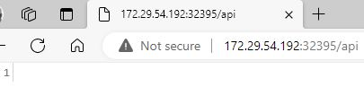
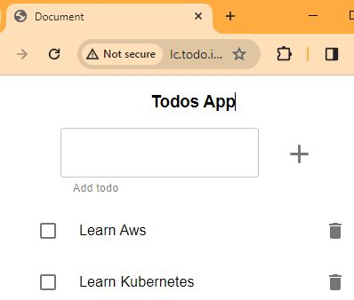
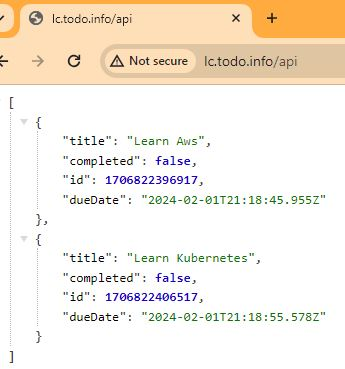

# Todo Application - Ingress
1. [Introduction](#intro)
2. [Set up Ingress on Minikube with the NGINX Ingress Controller](#setupIngress)
3. [Manifests](#manifests)
4. [Deployment and end to end testing](#e2e)
5. [Cleaning Up](#cleaning)
6. [Ingress on Win10 and minikube using docker driver](#dockerdriver)
<a name="intro"></a>

## 1. Introduction 
Create the Kubernetes resources to build a cluster like the following picture:


There are two apps, one UI exposed via an nginx and one express/nodejs API that connects to a postgres database. Both are reachable from an Ingress.


Solution structure 

```
├── manifests (new)
│   ├── kustomization.yaml 
│   ├── todo-api-configmap.yaml 
│   ├── todo-api-deployment.yaml 
│   ├── todo-api-service.yaml 
│   ├── todo-front-deployment.yaml 
│   ├── todo-front-service.yaml 
│   ├── todo-ingress.yaml 
│   ├── todo-namespace.yaml 
├── todo-api (existing)
│   ├── Dockerfile
├── todo-front (existing)
│   ├── Dockerfile
├── distributed-docker.md (new)
├── README.md (new)
```

<a name="setupIngress"></a>
## 2. Set up Ingress on Minikube with the NGINX Ingress Controller


### Create a minikube cluster

My device is running in Windows, and I can't access Minikube (v1.31.2) Ingress on Docker-Driver. The reason is because, at this moment, January 2024, Ingress is supported out-of-the-box on linux only. See more information in [Docker Driver - Known issues #7332](https://github.com/kubernetes/minikube/issues/7332). 

Then, for this exercise I will be using the [Hyper-V](https://minikube.sigs.k8s.io/docs/drivers/hyperv/) driver.

To use docker driver, please see section [Ingress on Win10 and minikube using docker driver](#dockerdriver).

#### Enabling Hyper-V
Open a PowerShell console as Administrator, and run the following command: 
```shell
Enable-WindowsOptionalFeature -Online -FeatureName Microsoft-Hyper-V -All
```

If Hyper-V was not previously active, you will need to reboot.

#### Usage
```shell
minikube delete --all
```
```shell
minikube start --driver=hyperv 
```

#### Enable the NGINX Ingress controller
Please follow the instructions to set up Ingres on Minikube in 
[enable the NGINX Ingress controller](https://kubernetes.io/docs/tasks/access-application-cluster/ingress-minikube/) page.

To enable the NGINX Ingress controller, run the following commands:

```bash
minikube addons enable ingress
```

```bash
minikube addons enable ingress-dns
```

Verify that the NGINX Ingress controller is running
```bash
$ kubectl get pods -n ingress-nginx
NAME                                        READY   STATUS      RESTARTS   AGE
ingress-nginx-admission-create-4fqf4        0/1     Completed   0          17m
ingress-nginx-admission-patch-pr25q         0/1     Completed   1          17m
ingress-nginx-controller-7799c6795f-sdcck   1/1     Running     0          17m 
```
<a name="manifests"></a>
## 3. Manifests

### Front and Back Images
To get connected front and back, we will build the `binarylavender/todo-front-distributed:v2` image by running the following command:
```bash
$ cd todo-front
$ docker build --build-arg="API_HOST=http://lc.todo.info" -t binarylavender/todo-front-distributed:v2 .
```
Push to Docker Hub repository: `$ docker push binarylavender/todo-front-distributed:v2`

### Kustomization

```bash
apiVersion: kustomize.config.k8s.io/v1beta1
kind: Kustomization
namespace: todo
resources:
- todo-namespace.yaml
- todo-api-configmap.yaml
- todo-api-deployment.yaml
- todo-api-service.yaml
- todo-front-deployment.yaml
- todo-front-service.yaml
- todo-ingress.yaml
```
### Namespace
```bash
apiVersion: v1
kind: Namespace
metadata:
  name: todo
```

### ConfigMap
```bash
apiVersion: v1
kind: ConfigMap
metadata:
  name: todo-api-cm
data:
  NODE_ENV: production
  PORT: "3000"
```

### Todo-api deployment
```bash
apiVersion: apps/v1
kind: Deployment
metadata:
  name: todo-api-deployment
  labels:
    app: todo-api
spec:  
  selector:
    matchLabels:
      app: todo-api
  template:
    metadata:
      labels:
        app: todo-api
    spec:
      containers:
      - name: todo-api
        image: binarylavender/todo-api-distributed:v1
        envFrom:
        - configMapRef:
            name: todo-api-cm      
        ports:
        - containerPort: 3000
        resources:
          limits:
            memory: "128Mi"
            cpu: "250m"
```

### Todo-api service
Service to expose the todo-api Deployment
```bash
apiVersion: v1
kind: Service
metadata:
  name: todo-api-svc
spec:
  selector:
    app: todo-api
  ports:
  - port: 3000
    targetPort: 3000
    name: http
    protocol: TCP
  type: NodePort
```

### Todo-front deployment
```bash
apiVersion: apps/v1
kind: Deployment
metadata:
  name: todo-front-deployment
  labels:
    app: todo-front
spec:
  selector:
    matchLabels:
      app: todo-front
  template:
    metadata:
      labels:
        app: todo-front  
    spec:
      containers:
      - name: todo-front
        image: binarylavender/todo-front-distributed:v2
        imagePullPolicy: IfNotPresent
        ports:
          - containerPort: 80
        resources:
          limits:
            memory: "128Mi"
            cpu: "250m"
```

### Todo-front service
Service to expose the todo-front Deployment
```bash
apiVersion: v1
kind: Service
metadata:
  name: todo-front-svc
spec:
  selector:
    app: todo-front  
  ports:
  - port: 80
    targetPort: 80
  type: NodePort
```

### Ingress
```bash
apiVersion: networking.k8s.io/v1
kind: Ingress
metadata:
  name: todo
  labels:
    name: todo
  annotations:
      INGRESS.kubernetes.io/rewrite-target: /
spec:
  ingressClassName: nginx
  rules:
  - host: lc.todo.info
    http:
      paths:
      - pathType: Prefix
        path: /
        backend:
          service:
            name: todo-front-svc
            port: 
             number: 80
      - pathType: Prefix
        path: /api
        backend:
          service:
            name: todo-api-svc
            port: 
              number: 3000
```

<a name="e2e"></a>
## 4. Deployment and end to end testing 

```bash
$ kubectl apply -k .
namespace/todo created
configmap/todo-api-cm created
service/todo-api-svc created
service/todo-front-svc created
deployment.apps/todo-api-deployment created
deployment.apps/todo-front-deployment created
ingress.networking.k8s.io/todo created
```

``` bash
$ kubectl get -k .
NAME             STATUS   AGE
namespace/todo   Active   50s

NAME                    DATA   AGE
configmap/todo-api-cm   2      50s

NAME                     TYPE       CLUSTER-IP      EXTERNAL-IP   PORT(S)          AGE
service/todo-api-svc     NodePort   10.110.38.219   <none>        3000:32395/TCP   50s
service/todo-front-svc   NodePort   10.106.106.96   <none>        80:32014/TCP     50s

NAME                                    READY   UP-TO-DATE   AVAILABLE   AGE
deployment.apps/todo-api-deployment     1/1     1            1           50s
deployment.apps/todo-front-deployment   1/1     1            1           50s

NAME                             CLASS   HOSTS          ADDRESS         PORTS   AGE
ingress.networking.k8s.io/todo   nginx   lc.todo.info   172.29.54.192   80      50s
```

Verify the Pods are running:
```bash
$ kubectl get pods -n todo
NAME                                     READY   STATUS    RESTARTS   AGE
todo-api-deployment-5cd6dc4fbc-rjz5j     1/1     Running   0          73s
todo-front-deployment-7d8644c66c-sk8ls   1/1     Running   0          73s
```

```bash
$ kubectl logs todo-api-deployment-5cd6dc4fbc-cpjxg -n todo
execute
Server running on port 3000
```

Verify the todo-api service is created and is available on a node port:

```bash
$ kubectl get service todo-api-svc -n todo
NAME           TYPE       CLUSTER-IP      EXTERNAL-IP   PORT(S)          AGE  
todo-api-svc   NodePort   10.110.38.219   <none>        3000:32395/TCP   6m38s
```

Visit the todo-api service via NodePort:

```shell
minikube service todo-api-svc -n todo
|-----------|--------------|-------------|----------------------------|
| NAMESPACE |     NAME     | TARGET PORT |            URL             |
|-----------|--------------|-------------|----------------------------|
| todo      | todo-api-svc | http/3000   | http://172.29.54.192:32395 |
|-----------|--------------|-------------|----------------------------|
* Opening service todo/todo-api-svc in default browser...
```

The output is similar to: http://172.29.54.192:32395 



```bash
$ curl http://172.29.54.192:32395/api
[]  
```

Verify the todo-front service is created and is available on a node port:

```bash
$ kubectl get service todo-front-svc -n todo
NAME             TYPE       CLUSTER-IP      EXTERNAL-IP   PORT(S)        AGE  
todo-front-svc   NodePort   10.106.106.96   <none>        80:32014/TCP   6m18s
```
Visit the todo-front service via NodePort:

```shell
C:\WINDOWS\system32>minikube service todo-front-svc -n todo
|-----------|----------------|-------------|----------------------------|
| NAMESPACE |      NAME      | TARGET PORT |            URL             |
|-----------|----------------|-------------|----------------------------|
| todo      | todo-front-svc |          80 | http://172.29.54.192:32014 |
|-----------|----------------|-------------|----------------------------|
* Opening service todo/todo-front-svc in default browser...
```
The output is similar to: http://172.29.54.192:32014 


```bash
$ curl http://172.29.54.192:32014
<!doctype html><html lang="en"><head><meta charset="UTF-8"><meta name="viewport" content="width=device-width,initial-scale=1"><title>Document</title><script defer="defer" src="app.86a4efbe2933bb434b8e.js"></script><script defer="defer" src="appStyles.0f296de458d0ffc030c5.js"></script><link href="appStyles.css" rel="stylesheet"></head><body><div id="root"></div></body></html>
```

You can now access the todo application via the Minikube IP address and NodePort. 

Verify the IP address of the ingress resource is set:

```bash
$ kubectl get ingress -n todo
NAME   CLASS   HOSTS          ADDRESS         PORTS   AGE
todo   nginx   lc.todo.info   172.29.54.192   80      11h
```

Verify that the Ingress controller is directing traffic: 

For that you can use "ad-hoc pinning" a web request directly to a specific IP address without using the site's public DNS records and can be accomplished by two ways:

1. Via command-line with cURL's "--resolve" option, formatted --resolve [DOMAIN]:[PORT]:[IP], that routes all web requests performed during the execution of a cURL command that match a given [DOMAIN] and [PORT] to a specified [IP] address.

    ```bash
    $ curl --resolve "lc.todo.info:80:$( minikube ip )" -i http://lc.todo.info
    HTTP/1.1 200 OK
    Date: Tue, 30 Jan 2024 21:15:04 GMT
    Content-Type: text/html
    Content-Length: 377
    Connection: keep-alive
    Last-Modified: Thu, 25 Jan 2024 09:30:04 GMT
    ETag: "65b22a1c-179"
    Accept-Ranges: bytes

    <!doctype html><html lang="en"><head><meta charset="UTF-8"><meta name="viewport" content="width=device-width,initial-scale=1"><title>Document</title><script defer="defer" src="app.86a4efbe2933bb434b8e.js"></script><script defer="defer" src="appStyles.0f296de458d0ffc030c5.js"></script><link href="appStyles.css" rel="stylesheet"></head><body><div id="root"></div></body></html>
    ```

    Note that `-i, --include` specify that the output should include the HTTP response headers. Example: curl -i http://lc.todo.info

2. Via your system's configuration files by changing your /etc/hosts file

   1. Look up the external IP address as reported by minikube:
      ```bash
      $ minikube ip
      172.29.54.192
      ```
   2. Add line similar to the following one to the bottom of the /etc/hosts file on your computer (you will need administrator access): `172.29.54.192 lc.todo.info`
  
      Note: Change the IP address to match the output from minikube ip.

      After you make this change, your web browser sends requests for a specified domain name "lc.todo.info" URLs to be routed from your local machine to to Minikube.
    3. Visit lc.todo.info from your browser and add some tasks.
  
        
        
        

<a name="cleaning"></a>
## 5. Cleaning Up

Delete all the manifests.
```bash
$ kubectl delete -k .
namespace "todo" deleted
configmap "todo-api-cm" deleted
service "todo-api-svc" deleted
service "todo-front-svc" deleted
deployment.apps "todo-api-deployment" deleted
deployment.apps "todo-front-deployment" deleted
ingress.networking.k8s.io "todo" deleted
```

<a name="dockerdriver"></a>
## 6. Ingress on Win10 and minikube using docker driver

Please follow the following steps for ingress to forward the requests using docker driver on Windows and kubernetes:

#### Set up Ingress
```shell
minikube delete --all
```

```shell
minikube start --driver=docker
```

```shell
minikube addons enable ingress
* ingress is an addon maintained by Kubernetes. For any concerns contact minikube on GitHub.
You can view the list of minikube maintainers at: https://github.com/kubernetes/minikube/blob/master/OWNERS
* After the addon is enabled, please run "minikube tunnel" and your ingress resources would be available at "127.0.0.1"
  - Using image registry.k8s.io/ingress-nginx/controller:v1.8.1
  - Using image registry.k8s.io/ingress-nginx/kube-webhook-certgen:v20230407
  - Using image registry.k8s.io/ingress-nginx/kube-webhook-certgen:v20230407
* Verifying ingress addon...
* The 'ingress' addon is enabled
```
```shell
minikube addons enable ingress-dns
* ingress-dns is an addon maintained by minikube. For any concerns contact minikube on GitHub.
You can view the list of minikube maintainers at: https://github.com/kubernetes/minikube/blob/master/OWNERS
* After the addon is enabled, please run "minikube tunnel" and your ingress resources would be available at "127.0.0.1"
  - Using image gcr.io/k8s-minikube/minikube-ingress-dns:0.0.2
* The 'ingress-dns' addon is enabled
```

Apply the manifests by running the command `$ kubectl apply -k .` and verify the pods are running succesfully.

```shell
minikube tunnel
* Tunnel successfully started

* NOTE: Please do not close this terminal as this process must stay alive for the tunnel to be accessible ...

! Access to ports below 1024 may fail on Windows with OpenSSH clients older than v8.1. For more information, see: https://minikube.sigs.k8s.io/docs/handbook/accessing/#access-to-ports-1024-on-windows-requires-root-permission
* Starting tunnel for service todo.
```

#### Using Port-Forwarding
Set custom domain IP to 127.0.01 in %WINDIR%\System32\drivers\etc\hosts file, i.e. by adding line `127.0.0.1 lc.todo.info`.

Start port forwarding to open a tunnel from host Virtual Machine port 80 to ingress-nginx-controller service (eventually pod) on port 80.

```bash
kubectl port-forward service/ingress-nginx-controller -n ingress-nginx 80:80
Forwarding from 127.0.0.1:80 -> 80
Handling connection for 80
```

Visit lc.todo.info from your browser to check that ingress is working on custom domain (but only when port forwarding is active).


More information about the root cause in [ingres not forwarding the requests docker desktop for windows and kubernetes](https://stackoverflow.com/questions/70011639/ingress-not-forwarding-the-requests-docker-desktop-for-windows-and-kubernetes).

#### Troubleshooting
When running the port forwarding command I got the following error message:
```
Unable to listen on port 80: Listeners failed to create with the following errors: [unable to create listener: Error listen tcp4 127.0.0.1:80: bind: An attempt was made to access a socket in a way forbidden by its access permissions. unable to create listener: Error listen tcp6 [::1]:80: bind: An attempt was made to access a socket in a way forbidden by its access permissions.]
error: unable to listen on any of the requested ports: [{80 80}]
```

You can view a list of which ports are excluded from your user by running this command:

`netsh interface ipv4 show excludedportrange protocol=tcp`

On my Windows 10 machine I get this output:

```
Protocol tcp Port Exclusion Ranges

Start Port    End Port
----------    --------
        80          80
        90          90
        97          97
      5357        5357
     49676       49775
     49776       49875
     50000       50059     *
     50128       50128
     50161       50260
     50489       50588
     50603       50702
     54902       55001
     55002       55101
     55102       55201
     55202       55301
     55402       55501
     57511       57610
     57611       57710

* - Administered port exclusions.
```
In my case port 80 was occupied by IIS. What I did was turning off IIS.