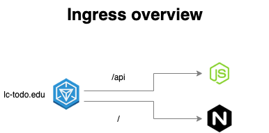

# DevOps - Lemoncode - Kubernetes
1. [Introduction](#intro)
2. [Set up Ingress on Minikube with the NGINX Ingress Controller](#setupIngress)
3. [Manifests](#manifests)
4. [Deployment and end to end testing](e2e)
5. [Cleaning Up](#cleaning)

<a name="intro"></a>
## 1. Introduction 
Create the Kubernetes resources to build a cluster like the following picture:



There are two apps, one UI exposed via an nginx and one express/nodejs API that connects to a postgres database. Both are reachable from an Ingress.


Solution structure 

```
├── manifests (new)
│   ├── kustomization.yaml 
│   ├── todo-api-configmap.yaml 
│   ├── todo-api-deployment.yaml 
│   ├── todo-api-service.yaml 
│   ├── todo-front-deployment.yaml 
│   ├── todo-front-service.yaml 
│   ├── todo-ingress.yaml 
│   ├── todo-namespace.yaml 
├── todo-api (existing)
│   ├── Dockerfile
├── todo-front (existing)
│   ├── Dockerfile
├── distributed-docker.md (new)
├── README.md (new)
```

<a name="setupIngress"></a>
## 2. Set up Ingress on Minikube with the NGINX Ingress Controller
[Enable the Ingress controller](https://kubernetes.io/docs/tasks/access-application-cluster/ingress-minikube/)

1. To enable the NGINX Ingress controller, run the following commands:

    ```bash
    minikube addons enable ingress-dns
    minikube addons enable ingress
    ```
2. Verify that the NGINX Ingress controller is running
    ```bash
    $ kubectl get pods -n ingress-nginx
    NAME                                        READY   STATUS      RESTARTS       AGE
    ingress-nginx-admission-create-4xwhq        0/1     Completed   1              9d 
    ingress-nginx-admission-patch-ttx9p         0/1     Completed   2              9d 
    ingress-nginx-controller-7799c6795f-9chjs   1/1     Running     10 (36m ago)   9d 
    ```
<a name="manifests"></a>
## 3. Manifests


<a name="e2e"></a>
## 4. Deployment and end to end testing 

```bash
$ kubectl apply -k .
namespace/todo created
configmap/todo-api-cm created
service/todo-api-svc created
service/todo-front-svc created
deployment.apps/todo-api-deployment created
deployment.apps/todo-front-deployment created
ingress.networking.k8s.io/todo created
```

```
$ kubectl get -k .
NAME             STATUS   AGE
namespace/todo   Active   7m38s

NAME                    DATA   AGE
configmap/todo-api-cm   2      7m38s

NAME                     TYPE       CLUSTER-IP       EXTERNAL-IP   PORT(S)          AGE
service/todo-api-svc     NodePort   10.103.251.158   <none>        3000:30821/TCP   7m38s
service/todo-front-svc   NodePort   10.107.39.234    <none>        80:31885/TCP     7m38s

NAME                                    READY   UP-TO-DATE   AVAILABLE   AGE
deployment.apps/todo-api-deployment     1/1     1            1           7m38s
deployment.apps/todo-front-deployment   1/1     1            1           7m38s

NAME                             CLASS   HOSTS          ADDRESS        PORTS   AGE
ingress.networking.k8s.io/todo   nginx   lc.todo.info   192.168.49.2   80      7m38s
```

```
$ kubectl get pods -n todo
NAME                                     READY   STATUS    RESTARTS   AGE
todo-api-deployment-5cd6dc4fbc-cpjxg     1/1     Running   0          7m51s
todo-front-deployment-6dfdbf58f8-5p759   1/1     Running   0          31s
```

```
$ kubectl logs todo-front-deployment-6dfdbf58f8-5p759 -n todo
/docker-entrypoint.sh: /docker-entrypoint.d/ is not empty, will attempt to perform configuration
/docker-entrypoint.sh: Looking for shell scripts in /docker-entrypoint.d/
/docker-entrypoint.sh: Launching /docker-entrypoint.d/10-listen-on-ipv6-by-default.sh
10-listen-on-ipv6-by-default.sh: info: Getting the checksum of /etc/nginx/conf.d/default.conf
10-listen-on-ipv6-by-default.sh: info: Enabled listen on IPv6 in /etc/nginx/conf.d/default.conf
/docker-entrypoint.sh: Sourcing /docker-entrypoint.d/15-local-resolvers.envsh
/docker-entrypoint.sh: Launching /docker-entrypoint.d/20-envsubst-on-templates.sh
/docker-entrypoint.sh: Launching /docker-entrypoint.d/30-tune-worker-processes.sh
/docker-entrypoint.sh: Configuration complete; ready for start up
2024/01/24 20:25:33 [notice] 1#1: using the "epoll" event method
2024/01/24 20:25:33 [notice] 1#1: nginx/1.25.3
2024/01/24 20:25:33 [notice] 1#1: built by gcc 12.2.0 (Debian 12.2.0-14)
2024/01/24 20:25:33 [notice] 1#1: OS: Linux 5.10.102.1-microsoft-standard-WSL2
2024/01/24 20:25:33 [notice] 1#1: getrlimit(RLIMIT_NOFILE): 1048576:1048576
2024/01/24 20:25:33 [notice] 1#1: start worker processes
2024/01/24 20:25:33 [notice] 1#1: start worker process 29
2024/01/24 20:25:33 [notice] 1#1: start worker process 30
2024/01/24 20:25:33 [notice] 1#1: start worker process 31
2024/01/24 20:25:33 [notice] 1#1: start worker process 32
10.244.0.1 - - [24/Jan/2024:20:27:21 +0000] "GET / HTTP/1.1" 200 377 "-" "Mozilla/5.0 (Windows NT 10.0; Win64; x64) AppleWebKit/537.36 (KHTML, like Gecko) Chrome/120.0.0.0 Safari/537.36 Edg/120.0.0.0" "-"
10.244.0.1 - - [24/Jan/2024:20:27:22 +0000] "GET /app.5cfa253021e0914308ee.js HTTP/1.1" 200 347237 "http://127.0.0.1:62062/" "Mozilla/5.0 (Windows NT 10.0; Win64; x64) AppleWebKit/537.36 (KHTML, like Gecko) Chrome/120.0.0.0 
Safari/537.36 Edg/120.0.0.0" "-"
10.244.0.1 - - [24/Jan/2024:20:27:22 +0000] "GET /appStyles.0f296de458d0ffc030c5.js HTTP/1.1" 200 0 "http://127.0.0.1:62062/" "Mozilla/5.0 (Windows NT 10.0; Win64; x64) AppleWebKit/537.36 (KHTML, like Gecko) Chrome/120.0.0.0 Safari/537.36 Edg/120.0.0.0" "-"
10.244.0.1 - - [24/Jan/2024:20:27:22 +0000] "GET /appStyles.css HTTP/1.1" 200 45 "http://127.0.0.1:62062/" "Mozilla/5.0 (Windows NT 10.0; Win64; x64) AppleWebKit/537.36 (KHTML, like Gecko) Chrome/120.0.0.0 Safari/537.36 Edg/120.0.0.0" "-"
2024/01/24 20:27:22 [error] 31#31: *4 open() "/usr/share/nginx/html/favicon.ico" failed (2: No such file or directory), client: 10.244.0.1, server: localhost, request: "GET /favicon.ico HTTP/1.1", host: "127.0.0.1:62062", referrer: "http://127.0.0.1:62062/"
10.244.0.1 - - [24/Jan/2024:20:27:22 +0000] "GET /favicon.ico HTTP/1.1" 404 555 "http://127.0.0.1:62062/" "Mozilla/5.0 (Windows NT 10.0; Win64; 
x64) AppleWebKit/537.36 (KHTML, like Gecko) Chrome/120.0.0.0 Safari/537.36 Edg/120.0.0.0" "-"
```


```
$ kubectl logs todo-api-deployment-5cd6dc4fbc-cpjxg -n todo
execute
Server running on port 3000
```
Check the external IP

```
$ kubectl get ingress
NAME   CLASS   HOSTS       ADDRESS        PORTS   AGE
todo   nginx   todo.info   192.168.49.2   80      5m12s
```

```shell
C:\WINDOWS\system32>minikube service todo-api-svc -n todo
|-----------|--------------|-------------|---------------------------|
| NAMESPACE |     NAME     | TARGET PORT |            URL            |
|-----------|--------------|-------------|---------------------------|
| todo      | todo-api-svc |        3000 | http://192.168.49.2:30821 |
|-----------|--------------|-------------|---------------------------|
* Starting tunnel for service todo-api-svc.
|-----------|--------------|-------------|------------------------|
| NAMESPACE |     NAME     | TARGET PORT |          URL           |
|-----------|--------------|-------------|------------------------|
| todo      | todo-api-svc |             | http://127.0.0.1:56524 |
|-----------|--------------|-------------|------------------------|
* Opening service todo/todo-api-svc in default browser...
! Because you are using a Docker driver on windows, the terminal needs to be open to run it.
```
```shell
C:\WINDOWS\system32>minikube service todo-front-svc -n todo
|-----------|----------------|-------------|---------------------------|
| NAMESPACE |      NAME      | TARGET PORT |            URL            |
|-----------|----------------|-------------|---------------------------|
| todo      | todo-front-svc |          80 | http://192.168.49.2:31885 |
|-----------|----------------|-------------|---------------------------|
* Starting tunnel for service todo-front-svc.
|-----------|----------------|-------------|------------------------|
| NAMESPACE |      NAME      | TARGET PORT |          URL           |
|-----------|----------------|-------------|------------------------|
| todo      | todo-front-svc |             | http://127.0.0.1:55744 |
|-----------|----------------|-------------|------------------------|
```

```bash
$ kubectl describe services todo-api-svc -n todo
Name:                     todo-api-svc
Namespace:                todo
Labels:                   <none>
Annotations:              <none>
Selector:                 app=todo-api
Type:                     NodePort
IP Family Policy:         SingleStack
IP Families:              IPv4
IP:                       10.103.251.158
IPs:                      10.103.251.158
Port:                     <unset>  3000/TCP
TargetPort:               3000/TCP
NodePort:                 <unset>  30821/TCP
Endpoints:                10.244.0.19:3000
Session Affinity:         None
External Traffic Policy:  Cluster
Events:                   <none>
```

```bash
$ kubectl describe services todo-front-svc -n todo
Name:                     todo-front-svc
Namespace:                todo
Labels:                   <none>        
Annotations:              <none>        
Selector:                 app=todo-front
Type:                     NodePort      
IP Family Policy:         SingleStack   
IP Families:              IPv4
IP:                       10.107.39.234
IPs:                      10.107.39.234
Port:                     <unset>  80/TCP
TargetPort:               http-web-svc/TCP
NodePort:                 <unset>  31885/TCP
Endpoints:                10.244.0.20:80
Session Affinity:         None
External Traffic Policy:  Cluster
Events:                   <none>
```

<a name="cleaning"></a>
## 5. Cleaning Up

Delete all the manifests.
```bash
$ kubectl delete -k .
namespace "todo" deleted
configmap "todo-api-cm" deleted
service "todo-api-svc" deleted
service "todo-front-svc" deleted
deployment.apps "todo-api-deployment" deleted
deployment.apps "todo-front-deployment" deleted
ingress.networking.k8s.io "todo" deleted
```