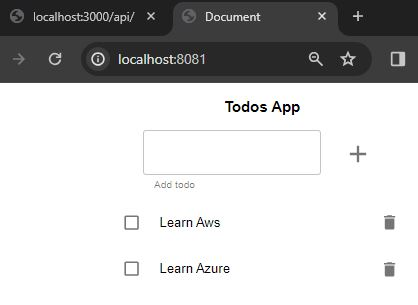
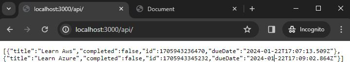

# Todo distributed app using Docker

1. [How to run the todo distributed app locally](#locally)
2. [How to run the todo distributed app with Docker](#docker)
3. [Cleaning Up](#cleaning)

<a name="locally"></a>
## 1. How to run the todo distributed app locally
Open two terminals, in one of them change directory to todo-api, and run npm run build, then npm start, in the other terminal change directory to todo-front, and run npm run build and npm start.

If you've got the following issue on todo-api when running npm start, `'ts-node' is not recognized as an internal or external command, operable program or batch file` you can add in the `todo-api/package.json` the following script: "dev:watch": "nodemon --exec npx ts-node ./src/app.ts"

<a name="docker"></a>
## 2. How to run the todo distributed app with Docker

Please follow these steps:
1. Log in to Docker by executing the command: `$ docker login`. Enter your username and password.
2. Firs start the back-end (todo-api) application. 
   1. Create .env with
      ```env
      NODE_ENV=production
      PORT=3000
      ```
   2. Create the image of the todo-api
      ```bash
      $ docker build -f todo-api/Dockerfile -t binarylavender/todo-api-distributed:v1 todo-api/ 
      ```
   3. Push to Docker Hub repository:
      `$ docker push binarylavender/todo-api-distributed:v1`
   4. Create the container by running the following command:
      ```bash
      $ docker run -d -p 3000:3000 \
      -e NODE_ENV=production \
      -e PORT=3000 \
      --name todo-api-distributed \
      binarylavender/todo-api-distributed:v1
      ```
   
3. Then start the front-end (todo-front) application.  
   1. In order to get connected front and back, you must build the front-end image as follows
      ```bash
      docker build --build-arg="API_HOST=http://localhost:3000" -f todo-front/Dockerfile -t binarylavender/todo-front-distributed:v1 todo-front/
      ```

      You can check that the images are created:

      ```bash
      $ docker image ls | grep "[^c]distributed"
      binarylavender/todo-api-distributed                                           v1                                                      fc824d69c1ef   27 hours ago    93.4MB
      binarylavender/todo-front-distributed                                         v1                                                      977ededd992b   28 hours ago    187MB
      ```

   2. Push to Docker Hub repository:
      `$ docker push binarylavender/todo-front-distributed:v1`

   3. Create the container exposing the external port by running the following command:
      ```bash
      $ docker run -d -p 8081:80 --name todo-front-distributed binarylavender/todo-front-distributed:v1
      9bb656051ec9109d91bd2650fe21e185c6069003f03a61c679c5e7644dc04f09
      ```
      Note that, by default, NGINX Ingress Controller listens on ports 80 and 443.
   4. Then you can hit http://localhost:8081 in your browser and add some tasks:
      

      You also can hit the backend http://localhost:3000/api/

      


<a name="cleaning"></a>
## 2. Cleaning Up

The `binarylavender/todo-api-distributed:v1` image will be used by the Kubernetes manifests. 

To remove the `binarylavender/todo-front-distributed:v1` image use the following command:

```bash
docker image rm binarylavender/todo-front-distributed:v1
```

To remove the two containers run the following commands:
```bash
docker container rm todo-front-distributed
docker container rm todo-api-distributed
```